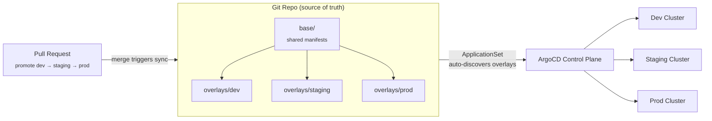

# GitOps-Driven Multi-Environment Deployment Platform

A single source-of-truth repo that drives dev, staging, and prod deployments via ArgoCD and Kustomize — with PR-based promotion gates, zero manual `kubectl apply`, and automated multi-cluster rollout through ArgoCD ApplicationSets.

## Architecture



## Why GitOps for promotion

Instead of a human running `kubectl apply` against three different clusters (and inevitably drifting), promotion is just **a pull request that changes which image tag / config an overlay points to**. Merging the PR is the deployment. ArgoCD continuously reconciles each cluster against what's declared in Git, so drift is detected and self-healed automatically.

## Repo structure

```
gitops-multi-env-platform/
├── base/                   # Shared Kustomize base (Deployment, Service, ConfigMap)
├── overlays/
│   ├── dev/                # Auto-synced on every merge to main
│   ├── staging/            # Requires PR approval to promote from dev
│   └── prod/                # Requires PR approval + passing staging soak time
├── argocd/
│   ├── applicationset.yaml # Auto-discovers overlays/* and creates one Application per env
│   └── projects.yaml       # ArgoCD AppProject scoping access per environment
├── scripts/
│   ├── promote.sh          # Opens a promotion PR (dev→staging or staging→prod)
│   └── diff-preview.sh     # Shows the exact diff a promotion PR will apply
└── .github/workflows/      # PR checks: kustomize build validation, diff comment on PR
```

## Quick start

```bash
# 1. Bootstrap the ApplicationSet (creates one ArgoCD Application per overlay)
kubectl apply -f argocd/projects.yaml
kubectl apply -f argocd/applicationset.yaml

# 2. Preview what changes a promotion would make
./scripts/diff-preview.sh dev staging

# 3. Promote dev → staging via PR (opens a PR bumping the staging overlay's image tag)
./scripts/promote.sh dev staging

# 4. After staging soak + approval, promote staging → prod
./scripts/promote.sh staging prod
```

## Promotion flow

1. New image lands in `overlays/dev/kustomization.yaml` automatically (via CI on merge to main) → ArgoCD auto-syncs dev.
2. Once verified in dev, `./scripts/promote.sh dev staging` opens a PR bumping the same image tag in `overlays/staging/`.
3. A required reviewer approves → merge → ArgoCD syncs staging automatically (auto-sync enabled for staging, manual sync-only for prod).
4. After a soak period, `./scripts/promote.sh staging prod` opens the prod promotion PR, requiring a second approver.

## Results

- New environment setup: **hours → minutes** via ApplicationSet auto-discovery instead of manually wiring up a new ArgoCD Application per cluster.
- Config drift: eliminated — ArgoCD's self-heal reverts any out-of-band cluster change back to what's declared in Git.
- Deployment errors from manual `kubectl apply`: eliminated — every change is a reviewed, auditable PR.
